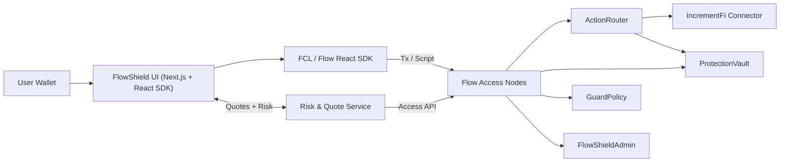

# Architecture

FlowShield is a SlipShield‑first stack that wraps DEX swaps with slippage refunds,
premium accounting, and a lightweight risk/quote service. DrawdownShield is
intentionally excluded from this build.

## System Diagram

## Core Modules

**On‑chain**
- `ActionRouter`: Executes swaps + settles refunds.
- `ProtectionVault`: Premium + underwriter pool, pays refunds.
- `GuardPolicy`: Per‑user slippage protection + epoch limits.
- `FlowShieldAdmin`: Global caps + pause.

**Off‑chain**
- **Risk/Quote Service**: Returns expected output, min‑out, premium estimate,
  and risk score. Indexes events for analytics.
- **Profit Drip Planner**: Calculates suggested premium sweeps.

**Frontend**
- Policy configuration UI.
- Quote display + protected swap execution.
- Vault stats + recent refunds.
- Admin actions (fund vault, profit drip).

## Runtime Flow (Protected Swap)

1. User configures policy and requests a quote from the service.
2. Frontend submits `protected_swap.cdc` via FCL.
3. `IncrementFiAdapter` executes the swap via Flow Actions.
4. `ActionRouter` compares output to `minOut`, charges premium, and pays refund.
5. Events are emitted and indexed by the service.

## Profit Drip (Payouts)

1. Service computes suggested drip amount using vault stats.
2. Admin executes `profit_drip.cdc` to sweep premiums into treasury receiver.
